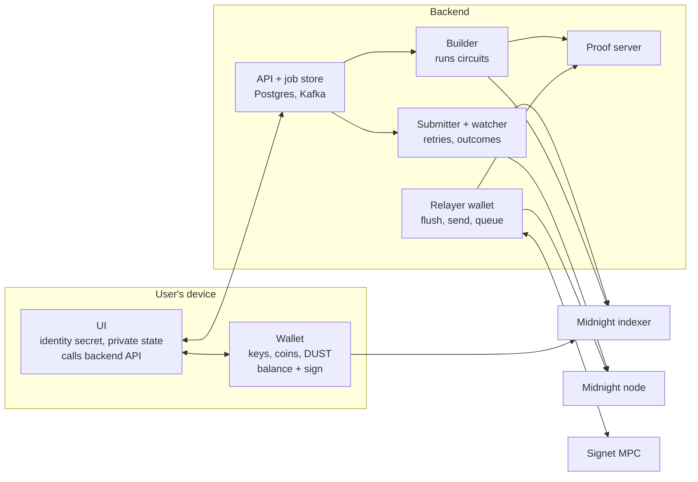
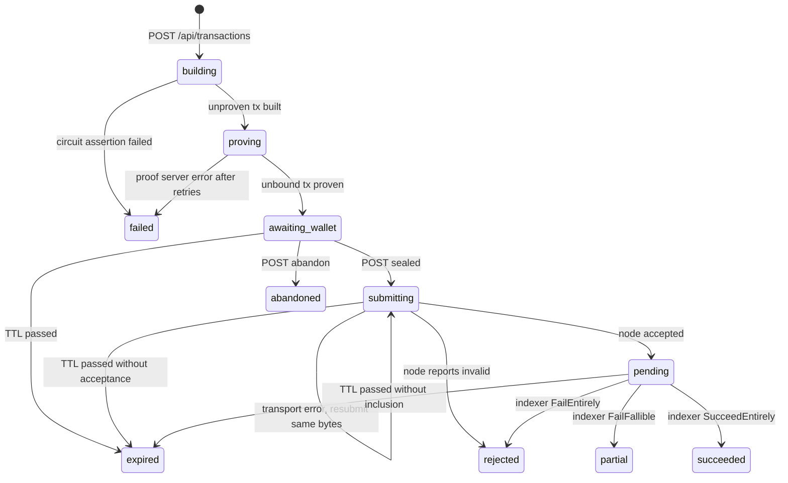
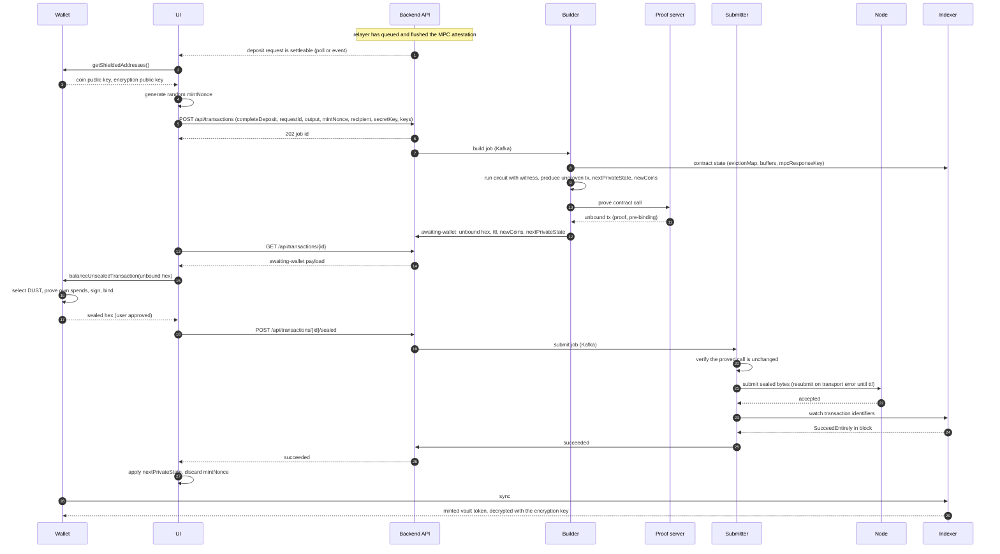

# Transaction architecture

This document describes how a Midnight transaction travels end to end through the
application, with the backend carrying as much of the flow as the protocol allows and the
user's own wallet keeping the keys. It is a design proposal: the API, the job states and the
tables below are not implemented yet. The split it proposes was derived from the installed SDK
(`@midnight-ntwrk/midnight-js` 5.0.0-beta.6 on `@midnightntwrk/ledger-v9`), the Midnight
ledger specification and the DApp connector API v4, and the facts it relies on are cited at
each step.

## Goals and constraints

- The user controls their wallet. Spending keys, coin keys and the DUST key never leave the
  wallet, whether that wallet is a browser extension (Lace, 1AM), an in-app mobile wallet or the
  seed wallet this repository ships for development.
- The backend owns the long and fragile parts: running the proof server, submitting to the
  node, waiting for inclusion, retrying submission, recording outcomes and driving the
  permissionless relayer steps of the vault protocol.
- The UI stays thin enough to be a mobile app. It never talks to a proof server and never
  needs the ledger WASM runtime, although it may run it (see the variant at the end).
- The backend is trusted with witness values. The user's private inputs cross to the backend
  so that it can build and prove the call. That is a deliberate trust decision, and the
  consequences are spelled out under Trust and privacy.

## What the ledger lets us split

A Midnight transaction is typed by its phase, and each phase needs a different set of
inputs. The ledger specification describes four phases and fixes where the wallet enters:
"the transaction gets handed to the wallet, which should not handle private information
relating to contract calls. For this purpose zero-knowledge proofs are done before the
handover". The SDK's transaction seams match those phases exactly.

| Phase                  | SDK type                                   | Needs                                                                                                                                                                       | Who can run it                   |
| ---------------------- | ------------------------------------------ | --------------------------------------------------------------------------------------------------------------------------------------------------------------------------- | -------------------------------- |
| 1. Build               | `UnprovenTransaction`                      | Compiled contract, the contract's current public state (indexer), the circuit arguments, the private state and witness values, the caller's coin and encryption public keys | UI or backend. No wallet secret. |
| 2. Prove               | `UnboundTransaction`, proof but no binding | The unproven transaction (which carries the private transcript), the circuit's prover key, verifier key and ZKIR, and a proof server                                        | Backend. No wallet secret.       |
| 3. Balance and sign    | `FinalizedTransaction`, sealed             | The wallet's unspent coins and DUST, the coin secret keys for shielded spend proofs, the DUST secret key, the unshielded signing key, the wallet's own proof server         | Wallet only.                     |
| 4. Submit and watch    | transaction identifiers, `FinalizedTxData` | The sealed bytes, a node and an indexer                                                                                                                                     | Backend. No wallet secret.       |
| 5. Apply private state | `nextPrivateState` from the build step     | The build result and the confirmed on-chain status                                                                                                                          | UI, after confirmation.          |

The consequences of that table drive everything below:

- Steps 1, 2 and 4 contain no wallet key and can move to the backend. Step 3 cannot, and it
  is the one step that needs the user's approval, which the wallet's own prompt supplies.
- The proof server sees witness values in the clear, since it performs arithmetic over them.
  The Midnight security guide calls it a trust boundary: a remote proof server is a trust
  decision about its operator. In this architecture the operator is the backend, and the
  backend already received the witness values to build the call, so proving on the backend
  adds no exposure beyond building there.
- The wallet learns nothing private about the call. It receives proofs and public
  transcripts, adds its own inputs, fee payment and signatures, and returns sealed bytes.

### Wallet contract

The DApp connector v4 `ConnectedAPI` is the contract the UI needs from any wallet, and it
needs only three of its methods:

| Method                              | Used for                                                                                                                                                             |
| ----------------------------------- | -------------------------------------------------------------------------------------------------------------------------------------------------------------------- |
| `getShieldedAddresses()`            | The coin public key and encryption public key the backend needs to build the call (`ownPublicKey()` in Compact, and the key outputs to the caller are encrypted to). |
| `balanceUnsealedTransaction(txHex)` | Step 3. Takes a serialised `Transaction<SignatureEnabled, Proof, PreBinding>`, pays fees, adds inputs and outputs, signs, binds and returns the sealed hex.          |
| `submitTransaction(txHex)`          | Not used on the main path. The backend submits instead, so retries and tracking live in one place. It remains a fallback when the backend is unreachable.            |

The repository's seed wallet (`src/lib/midnight/wallet/seed-wallet-facade.ts`) implements the
same step 3 with the wallet SDK facade: `balanceUnboundTransaction`, `signRecipe`,
`finalizeRecipe`. That is the proof that the contract above is sufficient: the development
wallet and a browser wallet differ only in where the keys live.

On mobile there is no injected `window.midnight`. The same contract is served by an in-app
wallet (1AM ships iOS and Android apps with a DApp browser, Kuira ships an embeddable Android
SDK with on-device proving) or by the application embedding the wallet SDK itself as the seed
wallet does. Those wallets prove their own spends on device or in their own proof server. The
backend's proof server only ever proves the contract call.

## Components



| Component          | Owns                                                                                                                                                                                                                                                                                                      |
| ------------------ | --------------------------------------------------------------------------------------------------------------------------------------------------------------------------------------------------------------------------------------------------------------------------------------------------------- |
| Wallet             | Every key. Coin selection, DUST fee payment, spend proofs through its own proof server, signatures and binding. Shows the approval prompt. Discovers received coins from the indexer.                                                                                                                     |
| UI                 | The wallet connection. The user's vault identity secret and the contract private state (page memory, per the engineering rules). Random inputs such as mint nonces. Starts jobs, relays the unbound transaction to the wallet and the sealed one back, applies the next private state after confirmation. |
| API and job store  | One row per transaction job in Postgres, one Kafka topic per asynchronous stage. Idempotency, ownership and the state machine below.                                                                                                                                                                      |
| Builder            | Runs the circuit with the SDK's `createUnprovenCallTx` against the indexer's view of the contract, with an in-memory private state provider seeded from the request. Produces the unproven transaction, `nextPrivateState` and `newCoins`.                                                                |
| Proof server       | The Midnight proof server container, reachable only from the backend network. Proves contract calls. Never sees a wallet key.                                                                                                                                                                             |
| Submitter, watcher | Submits sealed bytes to the node, resubmits identical bytes while the TTL allows, watches the indexer for inclusion and records the final status.                                                                                                                                                         |
| Relayer wallet     | A backend-owned seed wallet with its own DUST. Pays for and submits the permissionless vault circuits (`flushQueue`, `sendDeposit`, `queueAttestation*`) and polls the Signet singleton for MPC events. Never touches a user call.                                                                        |

## A transaction job

A job is the unit of work from "the user wants to call circuit X" to "the chain recorded the
outcome". The UI holds a job id, everything else is in the backend's store, so a closed tab or
a phone that goes to sleep loses nothing.

### API

Paths and payloads are proposals.

| Call                                  | Body                                                                                                                                                     | Response                                                                                                 |
| ------------------------------------- | -------------------------------------------------------------------------------------------------------------------------------------------------------- | -------------------------------------------------------------------------------------------------------- |
| `POST /api/transactions`              | `circuitId`, `args`, the witness values or private state, `coinPublicKey`, `encryptionPublicKey`, optional recipient encryption keys, an idempotency key | `202` with the job id. `409` when a live job exists for the same idempotency key or the same request id. |
| `GET /api/transactions/{id}`          | none                                                                                                                                                     | The job's state and, in `awaiting-wallet`, the unbound transaction hex, its TTL and `newCoins`.          |
| `POST /api/transactions/{id}/sealed`  | the sealed transaction hex from the wallet                                                                                                               | `202` once stored. `409` when the job is not in `awaiting-wallet` or the TTL has passed.                 |
| `POST /api/transactions/{id}/abandon` | none                                                                                                                                                     | Marks a job the user gave up on before sealing. A sealed job cannot be abandoned: the chain decides.     |

The UI polls `GET` with React Query, or subscribes to a server-sent event stream carrying the
same payload. Both read the same row.

### States



| State             | Meaning                                                                                                                                                                            |
| ----------------- | ---------------------------------------------------------------------------------------------------------------------------------------------------------------------------------- |
| `building`        | The builder runs the circuit. A Compact `assert` failing here is a normal outcome and ends the job with the assertion message.                                                     |
| `proving`         | The proof server proves the call. Tens of seconds for a large circuit, so it runs on a worker, never inside the request.                                                           |
| `awaiting-wallet` | The only state that needs the user. The UI fetches the unbound hex, hands it to the wallet, the user approves, the UI posts the sealed hex back.                                   |
| `submitting`      | The submitter sends the sealed bytes to the node and resubmits the same bytes on transport failure. The bytes are immutable, so a retry can never produce a different transaction. |
| `pending`         | The node accepted the transaction. The watcher follows the indexer until a terminal status or the TTL.                                                                             |
| `succeeded`       | `SucceedEntirely`. The UI applies `nextPrivateState` and refreshes balances.                                                                                                       |
| `partial`         | `FailFallible`. The guaranteed section applied and the fees were paid, a fallible section failed. Recorded on chain. The UI must not apply `nextPrivateState`.                     |
| `rejected`        | `FailEntirely`, or the node reported the transaction invalid. Nothing applied, no fee paid.                                                                                        |
| `expired`         | The intent's TTL passed. A guaranteed-phase failure is never written to the chain, so without a TTL the watcher could wait for ever. This is also the state after a long outage.   |
| `abandoned`       | The user cancelled before sealing.                                                                                                                                                 |

### Why the TTL bounds everything

Every intent carries a TTL, and the ledger accepts an intent only while block time is at or
before it and within the ledger's global margin. `createUnprovenCallTx` sets the call intent's
TTL to one hour from build time, and the wallet balances with its own TTL for the inputs it
books (this repository's seed wallet uses thirty minutes). Three things follow:

- Proving, approval and submission together have at most an hour. A job that sits in
  `awaiting-wallet` past the TTL is expired and needs a new build. The backend tells the UI
  the TTL so it can show a countdown and stop offering a stale transaction.
- Resubmitting identical bytes is safe and idempotent until the TTL, after which the node
  rejects them. The submitter needs no other deduplication.
- Once the TTL passes without inclusion the watcher can declare `expired` with certainty.

### What is retried without the user, and what is not

| Failure                                                     | Action                                                                                                                                                 |
| ----------------------------------------------------------- | ------------------------------------------------------------------------------------------------------------------------------------------------------ |
| Indexer unreachable while building                          | Retry the build. Nothing has been committed.                                                                                                           |
| Proof server unreachable or crashed                         | Retry proving from the stored unproven transaction. Proving is deterministic for the job and has no side effects.                                      |
| Node unreachable while submitting                           | Resubmit the same sealed bytes until the TTL. The transaction cannot change.                                                                           |
| Indexer unreachable while watching                          | Keep watching after reconnecting. The chain holds the answer, and the TTL bounds the wait.                                                             |
| Node reports invalid, or `FailEntirely`, or the TTL expires | Stop. The chain state the call was built against has moved, or the window closed. A new transaction needs a new build, a new proof and a new approval. |
| `FailFallible`                                              | Stop and record. Fees are spent. Whether to try again is the user's decision, with the new chain state in front of them.                               |

The rule behind the table: the backend may repeat any step whose inputs it already holds and
whose repetition cannot create a second transaction. It never builds and submits a new
transaction on its own, since a new transaction needs the wallet's approval. The wallet prompt
is the user's consent, once per sealed transaction.

A job that fails after `awaiting-wallet` leaves the UI with a clear next action: start a new
job. The backend may pre-build and pre-prove that new job from the witness values it still
holds, if the retention rule below allows it, so that the user only has to approve again.

### Ownership and idempotency

- The UI sends an idempotency key per user action. A second `POST` with the same key returns
  the existing job.
- Contract-level identity is stronger than the idempotency key. For the vault, a request id
  names one settlement, and `completeDeposit` can only succeed once for it. The job store
  refuses a second live job for the same circuit and request id, so two tabs, two taps or a
  slow preflight cannot build two competing transactions.
- The job records the coin public key it was built for. A sealed transaction posted back must
  carry the contract call the backend proved, unchanged. The backend compares the call intent
  in the sealed transaction against the unbound one it stored before submitting, so a client
  cannot swap in a different call under a job's identity.

### Witness retention

The build step needs the witness values, and the proof step needs the unproven transaction
that embeds the private transcript. After proving, neither is needed for the main path:

- The unproven transaction is deleted once the unbound one exists.
- The witness values are deleted when the job reaches a terminal state, or earlier under a
  stricter policy that deletes them once proving succeeds. The stricter policy means a retry
  after expiry needs the UI to resend them. That is the recommended default, since the UI
  holds them anyway and the cost is one more round trip.
- `newCoins` and `nextPrivateState` are handed to the UI with the unbound transaction and
  deleted from the backend on completion. The SDK marks both as privacy-sensitive.
- Nothing in this list is ever logged.

## End to end: completing a deposit

`completeDeposit` in the ERC-20 vault contract is the reference transaction. It settles a
deposit request after the Signet MPC attested the EVM transfer, and mints the deposited amount
as a shielded vault token to the caller, or to an optional recipient. Its inputs:

| Input              | Source                                                                                                                                                                                                                                |
| ------------------ | ------------------------------------------------------------------------------------------------------------------------------------------------------------------------------------------------------------------------------------- |
| `requestId`        | Public. The backend derived it when it sent the request and recorded it against the job that started the deposit.                                                                                                                     |
| `serializedOutput` | Public but unauthenticated. The one-byte Borsh result of the EVM transfer, recovered by the relayer from the EVM trace or the MPC output cache. The circuit checks it against the attestation digest, so a wrong byte fails the call. |
| `mintNonce`        | Private. Fresh random 32 bytes generated by the UI, never derived from the request id, since a derived nonce would let an observer link the minted coin to the deposit.                                                               |
| `recipient`        | Optional. Absent means the caller's own coin public key. A third party's key also needs that party's encryption public key passed to the build, so the output is encrypted for them.                                                  |
| `callerSecretKey`  | Witness. The 32-byte vault identity secret the UI holds. `settleRequest` recomputes the ownership commitment from it, which makes settling depositor-only.                                                                            |

The deposit protocol has ten steps. Only `startDeposit` (step 2) and `completeDeposit`
(step 10) are the depositor's own. The flushes, the send and the attestation queue are
permissionless, and the EVM broadcast and the polling for the MPC's signature and attestation
are off-chain work. In this architecture all of those belong to the backend's relayer, paid
from the relayer wallet's DUST, so the user approves exactly two Midnight transactions for a
deposit. The sequence below starts after the relayer has flushed the attestation (step 9) and
the job store marks the deposit as settleable.



Notes on the steps:

- Steps 8 and 9. The builder runs the compiled contract's `completeDeposit` against the
  indexer's view of the vault. `settleRequest` asserts the request was sent, is still open,
  has a flushed attestation above the entry's last-seen height, and that the ownership
  commitment matches the witness. Any of those failing ends the job as `failed` with the
  assertion message, before anything is proven.
- Step 9. The SDK encrypts outputs that go to the caller under the caller's encryption public
  key, which is why the build needs that key. The wallet then discovers the minted coin from
  the indexer like any other received coin (step 29). `newCoins` carries the same coin as a
  hint for wallets that want it.
- Step 16. The wallet adds the DUST spend for fees. Neither the contract call nor its proof
  changes. The user sees the wallet's own prompt with the fee.
- Steps 20 and 21. The backend checks that the sealed transaction still carries the contract call it
  proved. It then submits. The node runs the well-formedness check, which verifies every
  proof and the balance of each segment.
- Steps 23 and 24. The watcher identifies the transaction by its identifiers, not its hash,
  since a transaction can be extended by merging and its hash is not stable. `SucceedEntirely`
  is the only status after which the UI applies `nextPrivateState`.

## Trust and privacy

| Party            | Sees                                                                                                 | Cannot                                                             |
| ---------------- | ---------------------------------------------------------------------------------------------------- | ------------------------------------------------------------------ |
| Wallet           | The proven call, public transcripts, the fee it pays                                                 | See witness values, private state or the private transcript        |
| Backend          | Witness values, private state, the private transcript during proving, `nextPrivateState`, `newCoins` | Spend the user's coins, pay with the user's DUST, sign as the user |
| Proof server     | The unproven transaction including witness values                                                    | Sign or spend anything. It holds no keys.                          |
| Node and indexer | Public transcripts, proofs, commitments, nullifiers, the circuit and contract called                 | Open commitments, read witness values                              |

One point deserves its own paragraph. In the vault contract the witness is a bearer
credential: `callerSecretKey` is all that `settleRequest` checks, and the protocol does not tie
`ownPublicKey()` to the wallet that signed. A backend that holds the secret could therefore
build and pay for a `completeDeposit` of its own, naming its own recipient. Keeping the wallet
on the user's side protects the user's NIGHT, DUST and shielded coins. It does not, by itself,
protect the vault position from the backend. Three mitigations, in increasing strength:

1. Retention. The backend holds the secret only for the life of the job and never writes it
   to a log. This is the policy above.
2. Transport. The secret travels over TLS to the backend only, never in a URL, never in a
   query key, never to the proof server except inside the unproven transaction.
3. Contract design. A future contract revision can require the settlement transaction to
   carry something only the wallet can produce, for instance a coin the caller must spend into
   the call, so that the witness alone is not enough. That is a contract change and outside
   this document.

Users for whom mitigation 1 and 2 are not enough can use the UI-side build variant below with a
wallet that implements proving delegation, at the cost of the mobile story.

## Mapping onto this repository

| Piece             | Where                                                                                                                                                                                                                                                                                           |
| ----------------- | ----------------------------------------------------------------------------------------------------------------------------------------------------------------------------------------------------------------------------------------------------------------------------------------------- |
| Route handlers    | `src/app/api/transactions/`. They validate with zod, write the job row and publish to Kafka. They never prove or submit inline.                                                                                                                                                                 |
| Job store         | A `midnight_transaction_jobs` table in `src/lib/db/schema.ts`: id, idempotency key, circuit, request id, coin public key, state, unbound hex, sealed hex, identifiers, TTL, status, error, timestamps. Witness values and the unproven transaction in a separate table with a deletion rule.    |
| Workers           | Consumers started from `src/instrumentation.ts`, one group per stage: build and prove, submit and watch. Every replica joins the groups, Kafka partitions the jobs.                                                                                                                             |
| Builder providers | A server-side `MidnightProviders` set: the indexer as public data provider, the proof server as proof provider, the zk assets as the zk config provider, an in-memory private state provider seeded per job, and a wallet provider that only returns the job's coin and encryption public keys. |
| Proof server      | A `proof-server` service in `compose.yaml` next to Postgres and Kafka, on the backend network only. `MIDNIGHT_PROOF_SERVER_URL` already exists in the server configuration.                                                                                                                     |
| Relayer wallet    | The seed wallet facade from `src/lib/midnight/wallet/seed-wallet-facade.ts`, constructed on the server from a server-only seed variable, with its own DUST. Its jobs (flush, send, queue, EVM broadcast, polling) reuse the same job store with their own states.                               |
| Browser wallet    | A second `WalletKind` beside `seed` implementing the `Wallet` interface over the DApp connector, so `WalletTransactions.balanceTx` calls `balanceUnsealedTransaction` and `submitTx` posts to the backend.                                                                                      |
| UI                | A React Query mutation that starts the job and a query that follows it, a hook that performs the wallet handoff when the job reaches `awaiting-wallet`, and the vault identity secret kept in page memory as the engineering rules require.                                                     |

## Variant: the UI builds the unproven transaction

The UI may run the circuit itself and send the backend the serialised unproven transaction
instead of witness values. The backend then starts at `proving`. What changes:

- The UI needs the compiled contract and the ledger WASM runtime, which is the part a mobile
  app wants to avoid. A web UI can carry it.
- The backend's API narrows to "prove, submit and watch these bytes". It never sees witness
  values as structured data, although the unproven transaction still embeds the private
  transcript, so the trust position is the same.
- With a wallet that implements `getProvingProvider` (1AM does, Lace does not), the UI can
  delegate proving to the wallet and skip the backend's proof server entirely. The backend
  then only submits and watches, and the witness never leaves the device. This is the most
  private configuration and the least portable one.

The job states and the API from `awaiting-wallet` onwards are identical in both variants, so
both can be supported behind the same job store.

## Open decisions

- The exact TTL. One hour from build (the SDK default) against thirty minutes for the wallet's
  bookings. The shorter of the two is the effective window, and the UI should show it.
- Whether the backend pre-builds a replacement job after an expiry. It is a convenience that
  needs the witness retained past proving, which the default retention rule forbids.
- Fee sponsorship. The connector's `balanceUnsealedTransaction` accepts `payFees: false`, and
  the relayer wallet could then pay DUST through a second balancing step. The connector's
  documentation warns that balancing in a separate intent does not work for calls with
  fallible sections, so this needs a per-circuit check before it is offered.
- The event channel to the UI: polling through React Query is enough for a first version,
  server-sent events are the upgrade when the proving stage grows long.

## Deposit API

This section turns the two user-signed legs of a deposit, `startDeposit` and
`completeDeposit`, into a resource-oriented API in the style of Google's API Improvement
Proposals (AIPs). The notation is class-like pseudocode, not a wire format. Field behaviours
follow AIP-203: `OUTPUT_ONLY` is set by the backend and ignored on input, `IMMUTABLE` is set
on create and never changes, `INPUT_ONLY` is accepted on a request and never returned.

### Resources

Two resources carry the flow. A `Deposit` is the business object, one per deposit round
trip, and it lives for hours. A `Transaction` is one attempt to put one circuit call on
chain through the user's wallet. A deposit has at least two of them (one `START_DEPOSIT`,
one `COMPLETE_DEPOSIT`) and gains another whenever an attempt expires or is abandoned, so
every attempt stays on record and nothing is mutated back into an earlier state.

```
callers/{caller}
callers/{caller}/ethereum-erc20-vault-deposits/{deposit}
callers/{caller}/midnight-transactions/{transaction}
callers/{caller}/ethereum-transactions/{transaction}
```

Transactions are not nested under the deposit. Each transaction names the resource it serves in
its `parent` field, so a deposit's attempts are a search for its name, and the transaction
modules serve any resource that needs a call on chain. A partial unique index on `(parent,
circuit)` over the non-terminal states allows one live attempt per deposit step, so two
resolvers racing to retry cannot both create one.

`{caller}` is the application's caller id for the depositor, a SHA-256 of the vault identity
secret under an application domain tag. The server derives it from the caller secret that every
server action takes as its first argument (see Caller authentication in the README), so a caller
can only name their own caller as a parent. It is independent of the contract's `userCommitment`
of the same secret, so the application's names survive a change to the contract's hashing. Listing
a user's deposits is a list under it.

```ts
class Deposit {
  name: string                 // OUTPUT_ONLY. callers/{caller}/ethereum-erc20-vault-deposits/{deposit}
  erc20Address: Hex20          // REQUIRED, IMMUTABLE
  amount: bigint               // REQUIRED, IMMUTABLE. Base units, 1 to 2^64 - 1
  wallet: WalletKeys           // REQUIRED, IMMUTABLE. The wallet that signs both legs
  state: Deposit.State         // OUTPUT_ONLY
  inIndex: bigint              // OUTPUT_ONLY. Backend-chosen random request index
  evmNonce: bigint             // OUTPUT_ONLY. The deposit account's nonce, read from the EVM RPC
  gasLimit: bigint             // OUTPUT_ONLY. The circuit's GasParams, read from the EVM RPC
  maxFeePerGas: bigint         // OUTPUT_ONLY
  maxPriorityFeePerGas: bigint // OUTPUT_ONLY
  vaultRequestId: Hex32        // OUTPUT_ONLY. Known once sendDeposit is on chain
  attestation?: Attestation    // OUTPUT_ONLY. Known once the MPC has attested
  outcome?: Deposit.Outcome    // OUTPUT_ONLY. Known once completeDeposit is on chain
  activeTransaction?: Transaction  // OUTPUT_ONLY. The transaction the UI must act on, if any
  error?: Status               // OUTPUT_ONLY. Set with state FAILED
  createTime: Timestamp        // OUTPUT_ONLY
  updateTime: Timestamp        // OUTPUT_ONLY
}

class WalletKeys {
  coinPublicKey: Hex           // from the wallet's getShieldedAddresses()
  encryptionPublicKey: Hex
}

class Attestation {
  blockHeight: bigint
  outputKind: 'EXECUTED' | 'FAILED' | 'UNVIABLE'
  serializedOutput: Hex        // the bytes the circuit will check against the digest
}

enum Deposit.State {
  STATE_UNSPECIFIED,
  STARTING,       // the START_DEPOSIT transaction is in flight (any Transaction state)
  QUEUED,         // startDeposit succeeded: the entry sits in inputRequestBuffer
  FLUSHED,        // the relayer's flushQueue moved it to outputRequestBuffer
  SENT,           // the relayer's sendDeposit succeeded: vaultRequestId set, MPC notified
  EVM_SUBMITTED,  // the relayer broadcast the MPC-signed sweep on the EVM chain
  ATTESTED,       // the attestation is queued and flushed: completeDeposit may be built
  COMPLETING,     // the COMPLETE_DEPOSIT transaction is in flight
  COMPLETED,      // completeDeposit succeeded, see outcome
  FAILED,         // unrecoverable, see error
}

enum Deposit.Outcome {
  OUTCOME_UNSPECIFIED,
  MINTED,            // transfer returned true, the vault token was minted
  CLOSED_NO_TRANSFER // transfer returned false, or the verdict was FAILED or UNVIABLE
}
```

A deposit is `STARTING` from creation until the start transaction is on chain, and
`COMPLETING` from the creation of a completion transaction until that one is on chain. A
transaction that expires or is abandoned returns the deposit to the state before it
(`STARTING` with no active transaction, or `ATTESTED`), and the UI creates a new transaction.

```ts
class Transaction {
  name: string                 // OUTPUT_ONLY. callers/{caller}/midnight-transactions/{transaction}
  parent: string               // REQUIRED, IMMUTABLE. The deposit the attempt serves
  circuit: Transaction.Circuit // REQUIRED, IMMUTABLE
  wallet?: WalletKeys          // IMMUTABLE. Defaults to the deposit's wallet
  state: Transaction.State     // OUTPUT_ONLY
  unboundTx?: Hex              // OUTPUT_ONLY. Proven, unbalanced. Present in PENDING_WALLET
  expireTime?: Timestamp       // OUTPUT_ONLY. The intent TTL. Present from PENDING_WALLET
  sealedTx?: Hex               // OUTPUT_ONLY once accepted by :submit, never on create
  identifiers: string[]        // OUTPUT_ONLY. Ledger identifiers, present from SUBMITTED
  blockHeight?: bigint         // OUTPUT_ONLY. Present in SUCCEEDED, PARTIAL and REJECTED
  error?: Status               // OUTPUT_ONLY. Set with FAILED and REJECTED
  createTime: Timestamp        // OUTPUT_ONLY
  updateTime: Timestamp        // OUTPUT_ONLY
}

enum Transaction.Circuit {
  CIRCUIT_UNSPECIFIED,
  START_DEPOSIT,
  COMPLETE_DEPOSIT,
}

enum Transaction.State {
  STATE_UNSPECIFIED,
  PREPARING,       // building and proving
  PENDING_WALLET,  // unboundTx available, waiting for :submit with the sealed bytes
  SUBMITTED,       // accepted by the node, waiting for inclusion
  SUCCEEDED,       // SucceedEntirely
  PARTIAL,         // FailFallible: on chain, fees paid, the call did not apply
  REJECTED,        // FailEntirely, or the node refused the bytes
  EXPIRED,         // expireTime passed before inclusion
  ABANDONED,       // the UI gave up before :submit
  FAILED,          // build or proof failed, see error
}
```

The witness values are never fields of a resource. They travel once, on the create request
that needs them, as `INPUT_ONLY` request fields, and the backend discards them as described
under Witness retention.

### Methods

```ts
service DepositService {
  // Standard methods (AIP-131, AIP-132, AIP-133).
  GetDeposit(name): Deposit
  ListDeposits(parent, filter?, pageSize?, pageToken?): { deposits: Deposit[], nextPageToken }
  CreateDeposit(parent, deposit: Deposit, secretKey: Hex32, requestId?: string): Deposit

  GetTransaction(name): Transaction
  ListTransactions(parent, pageSize?, pageToken?): { transactions: Transaction[], nextPageToken }
  CreateTransaction(parent, transaction: Transaction, secretKey: Hex32,
                    mintNonce?: Hex32, recipient?: Recipient, requestId?: string): Transaction

  // Custom methods (AIP-136).
  SubmitTransaction(name, sealedTx: Hex): Transaction      // POST {name}:submit
  AbandonTransaction(name): Transaction                    // POST {name}:abandon
}
```

| Method               | HTTP                                                  | What the backend does                                                                                                                                                                                                                                                                                                                                                           |
| -------------------- | ----------------------------------------------------- | ------------------------------------------------------------------------------------------------------------------------------------------------------------------------------------------------------------------------------------------------------------------------------------------------------------------------------------------------------------------------------- |
| `CreateDeposit`      | `POST /v1/{parent=callers/*}/deposits`                | Validates the ERC-20 is allowed and the amount is in range, derives the caller from `secretKey` and checks it against `parent`, chooses `inIndex`, reads `evmNonce` and gas from the EVM side, writes the deposit in `STARTING`, and creates its `START_DEPOSIT` transaction in `PREPARING`. Returns the deposit with `activeTransaction` set. Build and proof run on a worker. |
| `GetDeposit`         | `GET /v1/{name=callers/*/deposits/*}`                 | Returns the deposit. This is what the UI polls: `state` tells it whether to wait, hand `activeTransaction.unboundTx` to the wallet, or create the completion transaction.                                                                                                                                                                                                       |
| `ListDeposits`       | `GET /v1/{parent=callers/*}/deposits`                 | Lists the caller's deposits. `filter` follows AIP-160, for instance `state = ATTESTED`.                                                                                                                                                                                                                                                                                         |
| `CreateTransaction`  | `POST /v1/{parent=callers/*/deposits/*}/transactions` | With `circuit = COMPLETE_DEPOSIT`: allowed only in `ATTESTED`. Builds and proves `completeDeposit` from `vaultRequestId`, `attestation.serializedOutput`, `mintNonce`, `recipient` and `secretKey`, moves the deposit to `COMPLETING`. With `circuit = START_DEPOSIT`: allowed only in `STARTING` with no active transaction, for a retry after expiry or abandonment.          |
| `GetTransaction`     | `GET /v1/{name=.../transactions/*}`                   | Returns one attempt. Useful after the deposit has moved on, to see what happened to an earlier attempt.                                                                                                                                                                                                                                                                         |
| `ListTransactions`   | `GET /v1/{parent=.../deposits/*}/transactions`        | Every attempt of the deposit, newest first.                                                                                                                                                                                                                                                                                                                                     |
| `SubmitTransaction`  | `POST /v1/{name=.../transactions/*}:submit`           | Allowed only in `PENDING_WALLET` before `expireTime`. Checks the sealed bytes still carry the call it proved, stores them, moves to `SUBMITTED`, submits and watches. Returns the transaction. The deposit advances when the watcher records the result.                                                                                                                        |
| `AbandonTransaction` | `POST /v1/{name=.../transactions/*}:abandon`          | Allowed in `PREPARING` or `PENDING_WALLET`. Moves to `ABANDONED` and clears the deposit's `activeTransaction`. A `SUBMITTED` transaction cannot be abandoned: the chain decides.                                                                                                                                                                                                |

`requestId` on both create methods is the AIP-155 idempotency token, a client-generated UUID.
A repeat with the same token returns the existing resource. It is distinct from
`vaultRequestId`, the on-chain id of the request. The backend also enforces the stronger
contract-level rule from Ownership and idempotency: one live transaction per deposit and
circuit, so two `CreateTransaction` calls for the completion of one deposit cannot both
build.

The two create methods return the resource immediately rather than a long-running operation.
The resource exists at once, its `state` is the operation's progress, and the UI has to hold
the resource name anyway. An operation would duplicate the state field and add a second thing
to poll. If a client ever needs operation semantics, the create methods can return an
`Operation` whose result is the resource without changing the resources themselves.

Transport. This UI is the only client, so the methods are exposed as server actions in
`src/server/actions/deposit-actions.ts`, typed end to end, with no HTTP surface. The HTTP column above records the
AIP mapping the names and methods were designed against, for the day another client exists.

### The flow as the UI sees it

```ts
// 1. Start.
let deposit = await CreateDeposit(caller, { erc20Address, amount, wallet }, secretKey, uuid())
// deposit.state == STARTING, deposit.activeTransaction.state == PREPARING

deposit = await pollUntil(
  () => GetDeposit(deposit.name),
  (d) => d.activeTransaction?.state !== 'PREPARING',
)
// activeTransaction.state == PENDING_WALLET, unboundTx and expireTime set

const sealed = await wallet.balanceUnsealedTransaction(deposit.activeTransaction.unboundTx)
await SubmitTransaction(deposit.activeTransaction.name, sealed.tx)

// 2. Wait for the relayer and the MPC. Nothing to do: QUEUED, FLUSHED, SENT, EVM_SUBMITTED.
deposit = await pollUntil(
  () => GetDeposit(deposit.name),
  (d) => d.state === 'ATTESTED' || d.state === 'FAILED',
)

// 3. Complete.
const completion = await CreateTransaction(
  deposit.name,
  { circuit: 'COMPLETE_DEPOSIT' },
  secretKey,
  randomBytes(32),
  undefined,
  uuid(),
)
deposit = await pollUntil(
  () => GetDeposit(deposit.name),
  (d) => d.activeTransaction?.state !== 'PREPARING',
)

const sealedCompletion = await wallet.balanceUnsealedTransaction(
  deposit.activeTransaction.unboundTx,
)
await SubmitTransaction(completion.name, sealedCompletion.tx)

deposit = await pollUntil(
  () => GetDeposit(deposit.name),
  (d) => d.state === 'COMPLETED' || d.state === 'FAILED',
)
// deposit.outcome == MINTED
```

`pollUntil` stands for a React Query query with a refetch interval, or a server-sent event
stream on the deposit name that pushes the same resource. A page reload loses nothing: the
UI lists the caller's deposits, finds the one with an `activeTransaction`, and carries on.

### Relation to the sketch

| Sketch                 | Here                                                                                                                                                                                                         |
| ---------------------- | ------------------------------------------------------------------------------------------------------------------------------------------------------------------------------------------------------------ |
| `CreateDeposit`        | `CreateDeposit`, which also creates the `START_DEPOSIT` transaction                                                                                                                                          |
| `SubmitDeposit`        | `SubmitTransaction` on that transaction                                                                                                                                                                      |
| `StartCompleteDeposit` | `CreateTransaction` with `circuit = COMPLETE_DEPOSIT`                                                                                                                                                        |
| `EndCompleteDeposit`   | `SubmitTransaction` on the completion transaction                                                                                                                                                            |
| `txn` on the deposit   | `unboundTx` and `sealedTx` on the transaction, so the two legs and every retry each have their own bytes, TTL and identifiers                                                                                |
| `state` on the deposit | Split in two: `Deposit.State` tracks the protocol, `Transaction.State` tracks one on-chain attempt. "proved" and "balanced" belong to the attempt, "queued", "flushed" and "evm submitting" to the protocol. |
